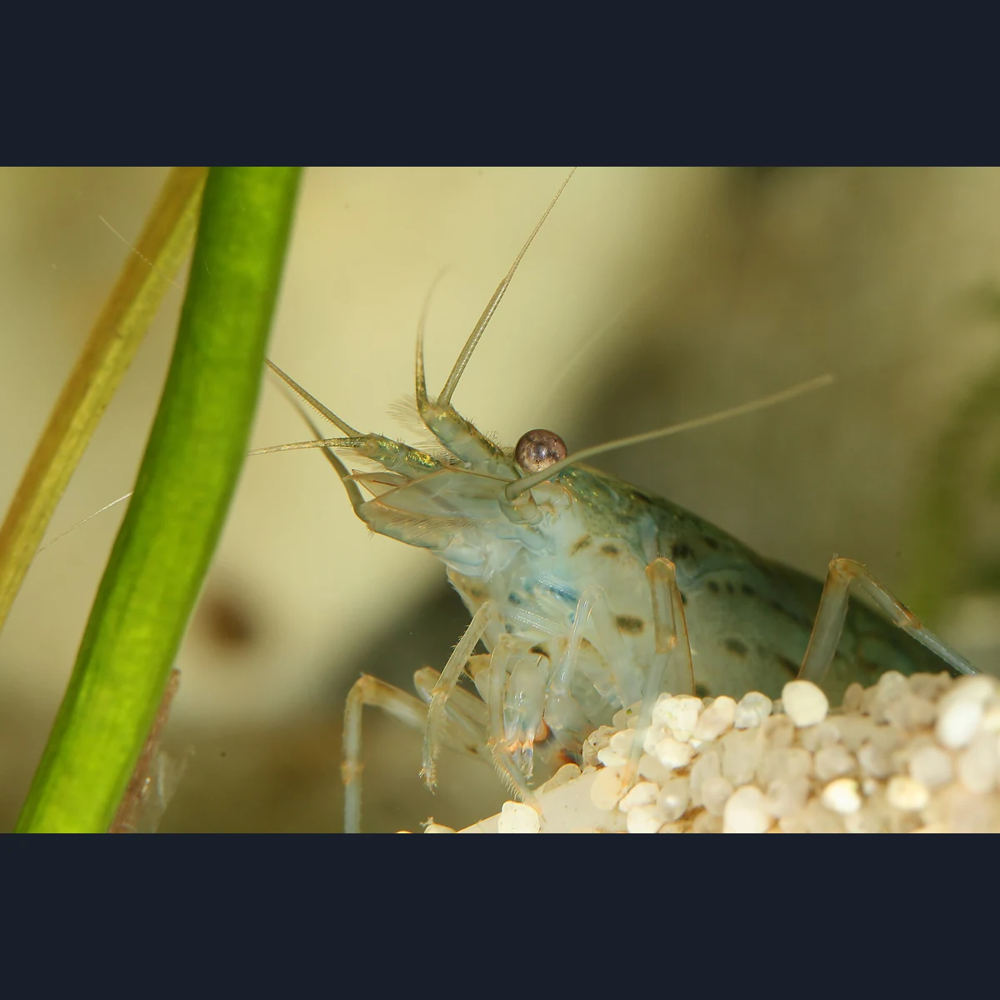
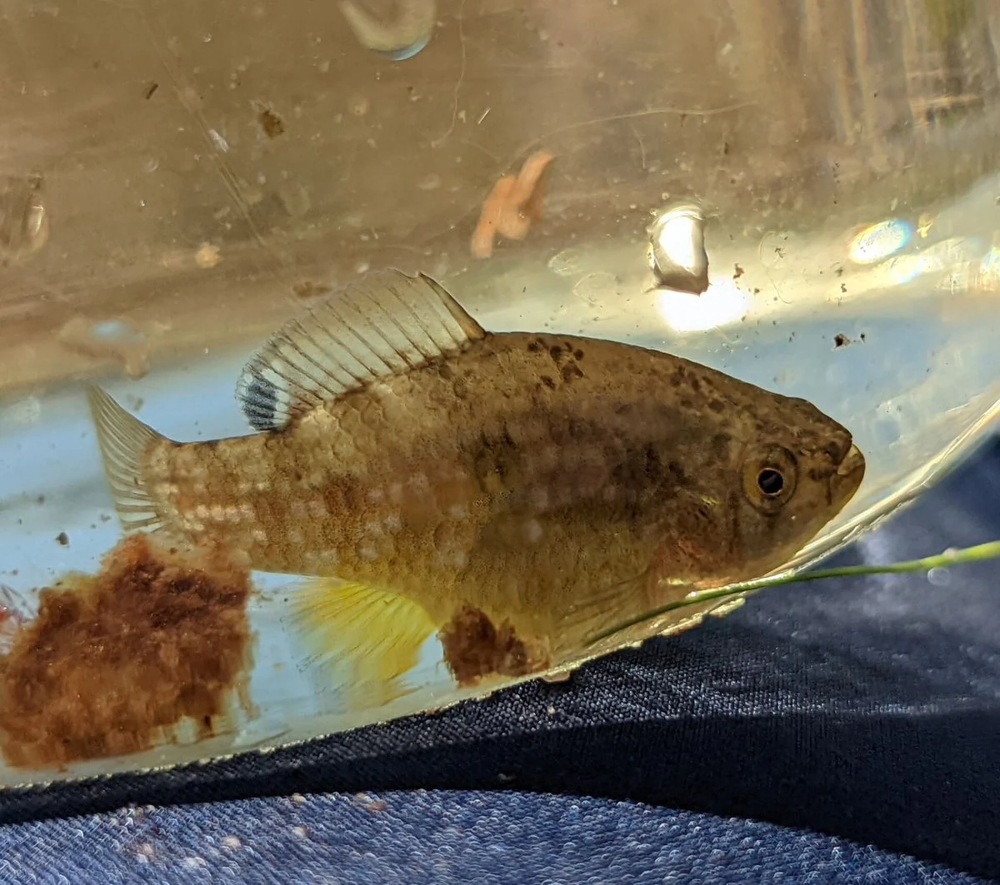
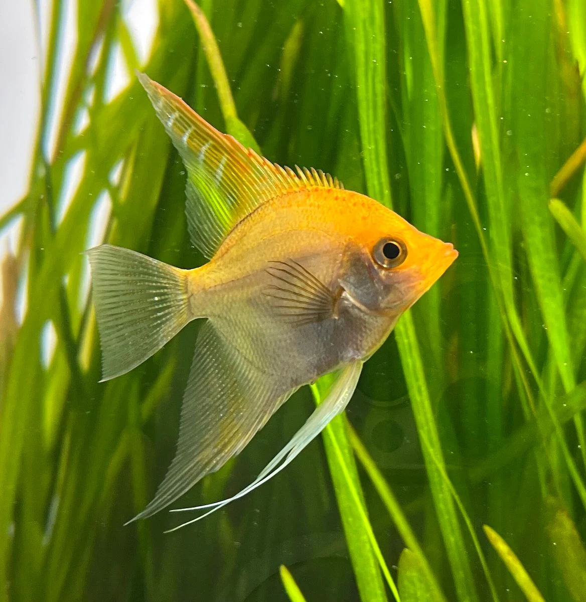
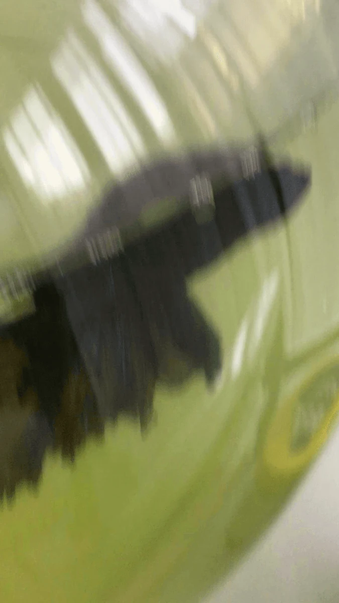
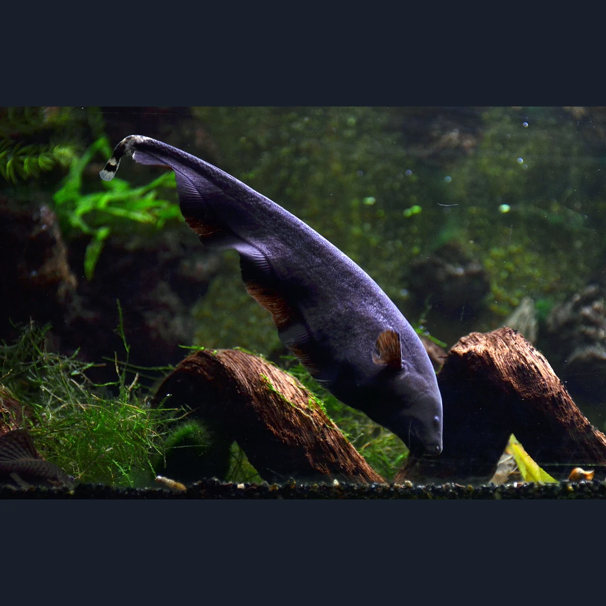
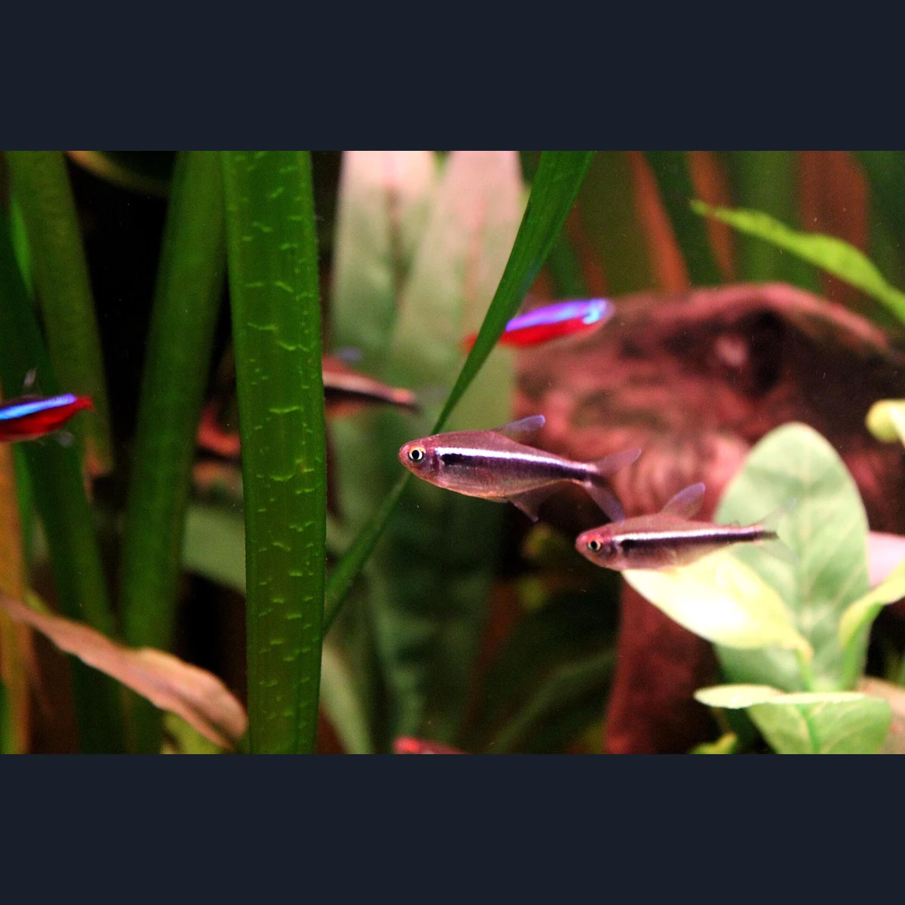
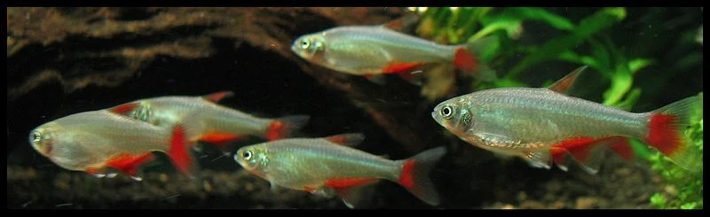
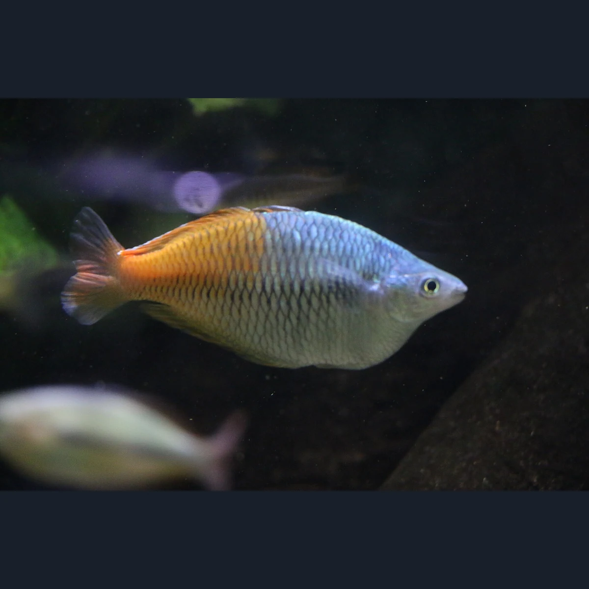
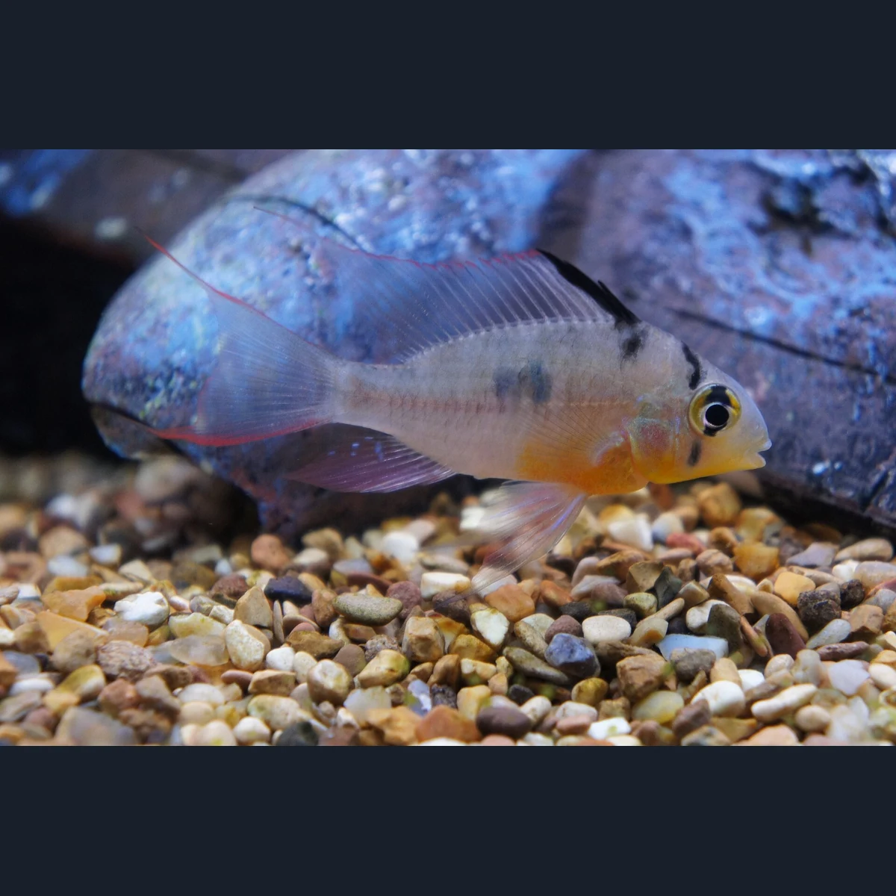

# Species image candidate review

Nothing in this report is approved or published yet.

Review identity, anatomy, crop, clarity, source, creator, attribution, license, and commercial/modification rights. Natural aquarium or neutral backgrounds are allowed. Reject images with solid letterbox bars, misleading content, bad crops, or unclear rights.

After reviewing every candidate, edit `data/images/species-image-review.json`. Put every slug in either `approved` or `rejected`, include a reason for every rejection, and set `rightsConfirmed` to `true` only after completing the rights review.

## amano-shrimp

- Preparation: Prepared aspect-preserving WebP
- Source: [Wikimedia Commons](https://commons.wikimedia.org/wiki/File:Caridina_multidentata_close.jpg)
- Creator: Richard Bartz, Munich Makro Freak
- License: [CC BY-SA 2.5](https://creativecommons.org/licenses/by-sa/2.5)
- Attribution: Own work

## american-flagfish

- Preparation: Prepared aspect-preserving WebP
- Source: [Wikimedia Commons](https://commons.wikimedia.org/wiki/File:Jordanella_floridae_182122551.jpg)
- Creator: nat_t
- License: [CC0](http://creativecommons.org/publicdomain/zero/1.0/deed.en)
- Attribution: https://www.inaturalist.org/photos/182122551

## angelfish

- Preparation: Prepared aspect-preserving WebP
- Source: [Wikimedia Commons](https://commons.wikimedia.org/wiki/File:Pterophyllum_scalare_03.jpg)
- Creator: Versions111
- License: [CC BY 4.0](https://creativecommons.org/licenses/by/4.0)
- Attribution: Own work

## betta-splendens

- Preparation: Prepared aspect-preserving WebP
- Source: [Wikimedia Commons](https://commons.wikimedia.org/wiki/File:Betta_fish_(Betta_splendens).gif)
- Creator: Atlas Þə Biologist (number 2)
- License: [CC BY 4.0](https://creativecommons.org/licenses/by/4.0)
- Attribution: Own work

## black-ghost-knifefish

- Preparation: Prepared aspect-preserving WebP
- Source: [Wikimedia Commons](https://commons.wikimedia.org/wiki/File:Apteronotus_albifrons_Aquarium_tropical_du_Palais_de_la_Porte_Dor%C3%A9e_10_04_2016_1.jpg)
- Creator: Vassil
- License: [CC0](http://creativecommons.org/publicdomain/zero/1.0/deed.en)
- Attribution: Own work

## black-moor-goldfish

- Preparation: Prepared aspect-preserving WebP
- Source: [Wikimedia Commons](https://commons.wikimedia.org/wiki/File:Carassius_auratus_-_ilustraci%C3%B3n_gouache.jpg)
- Creator: Elixabette Arroiabe Azurmendi
- License: [CC BY-SA 4.0](https://creativecommons.org/licenses/by-sa/4.0)
- Attribution: Own work

## black-neon-tetra

- Preparation: Prepared aspect-preserving WebP
- Source: [Wikimedia Commons](https://commons.wikimedia.org/wiki/File:02.Hyphessobrycon_herbertaxelrodi.JPG)
- Creator: Juan R. Lascorz
- License: [CC BY-SA 3.0](https://creativecommons.org/licenses/by-sa/3.0)
- Attribution: Own work

## bloodfin-tetra

- Preparation: Prepared aspect-preserving WebP
- Source: [Wikimedia Commons](https://commons.wikimedia.org/wiki/File:Aphyocharax_anisitsi_2.jpg)
- Creator: VGW2006 at en.wikipedia
- License: [Public domain](https://commons.wikimedia.org/wiki/File:Aphyocharax_anisitsi_2.jpg)
- Attribution: Transferred from en.wikipedia

## boesemani-rainbowfish

- Preparation: Prepared aspect-preserving WebP
- Source: [Wikimedia Commons](https://commons.wikimedia.org/wiki/File:Melanotaenia_boesemani_-_IMG_0448.jpg)
- Creator: Cangadoba
- License: [CC BY-SA 4.0](https://creativecommons.org/licenses/by-sa/4.0)
- Attribution: Own work

## bolivian-ram

- Preparation: Prepared aspect-preserving WebP
- Source: [Wikimedia Commons](https://commons.wikimedia.org/wiki/File:A_Bolivian_Ram_-_Mikrogeophagus_altispinosus.JPG)
- Creator: Corpse89
- License: [CC BY-SA 3.0](https://creativecommons.org/licenses/by-sa/3.0)
- Attribution: Own work
