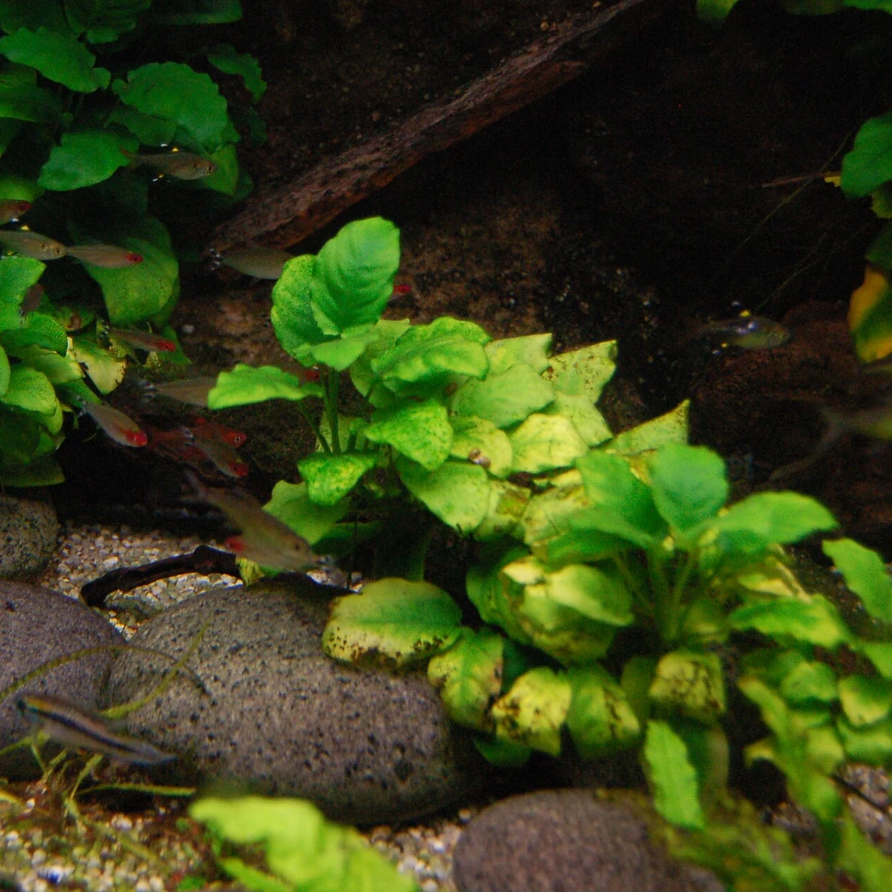
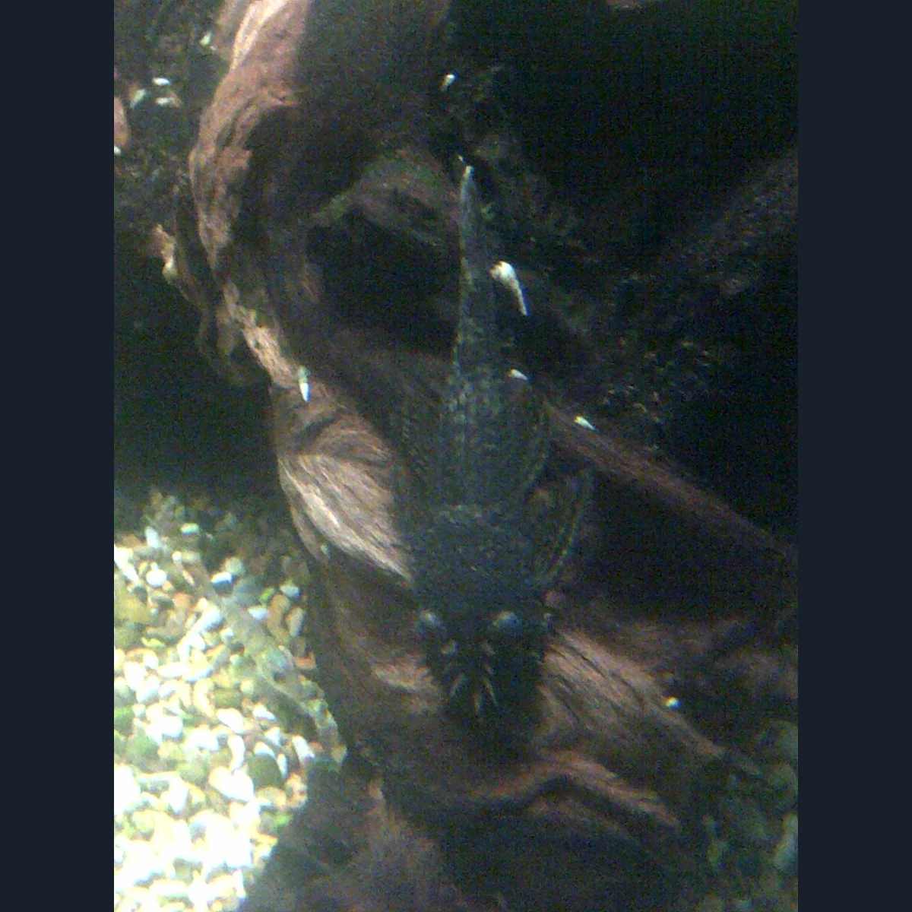
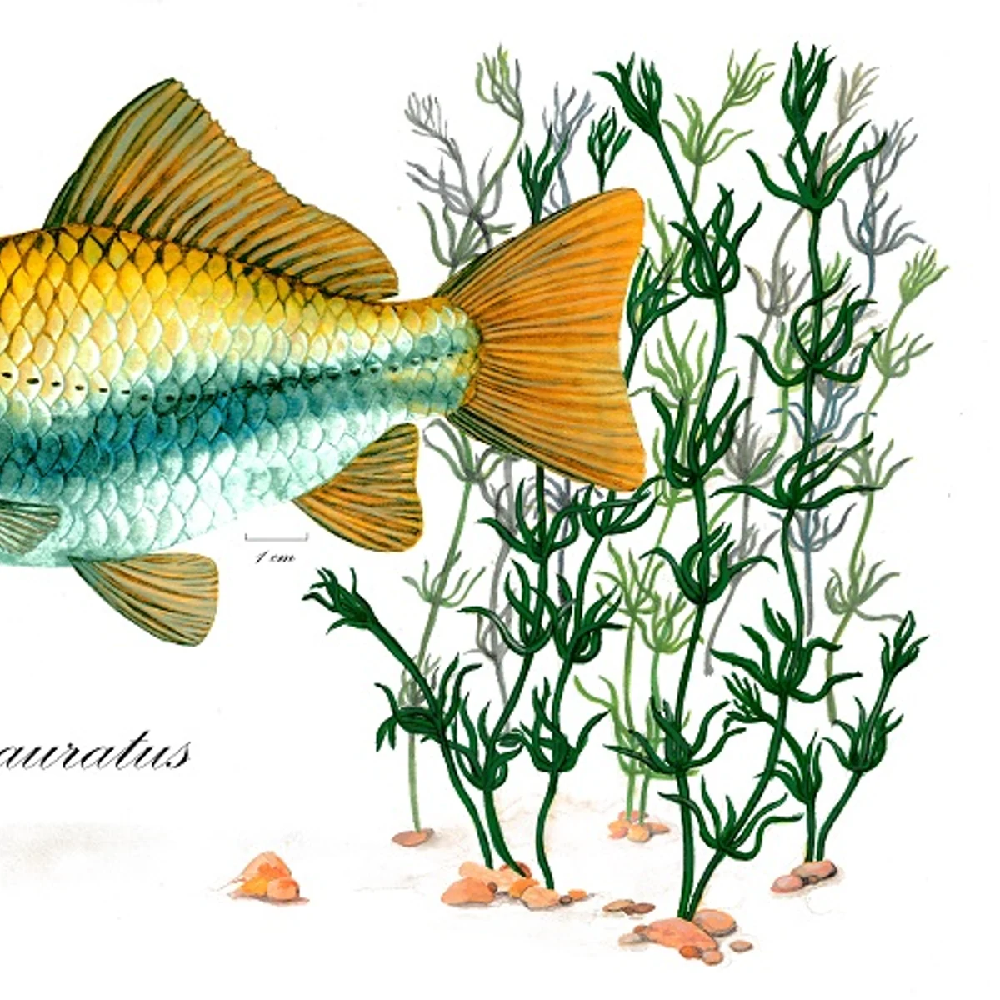
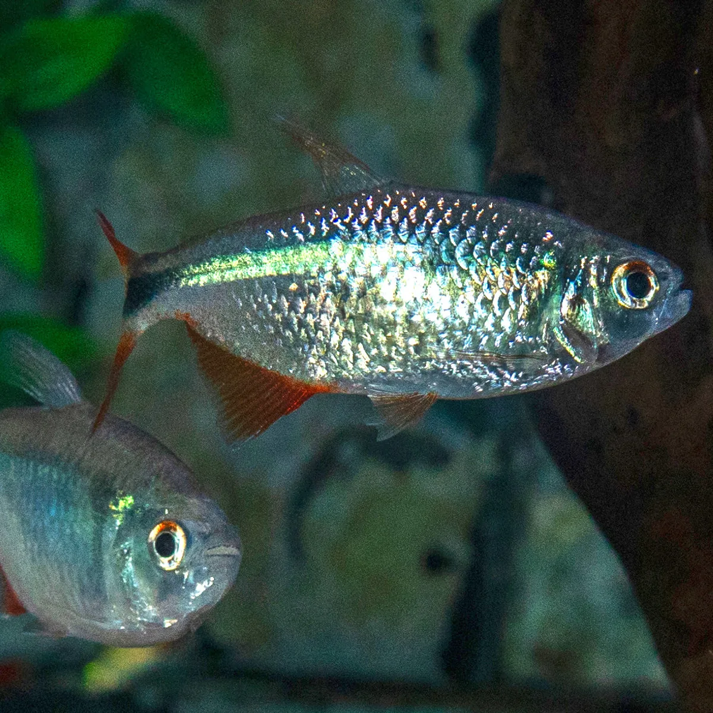
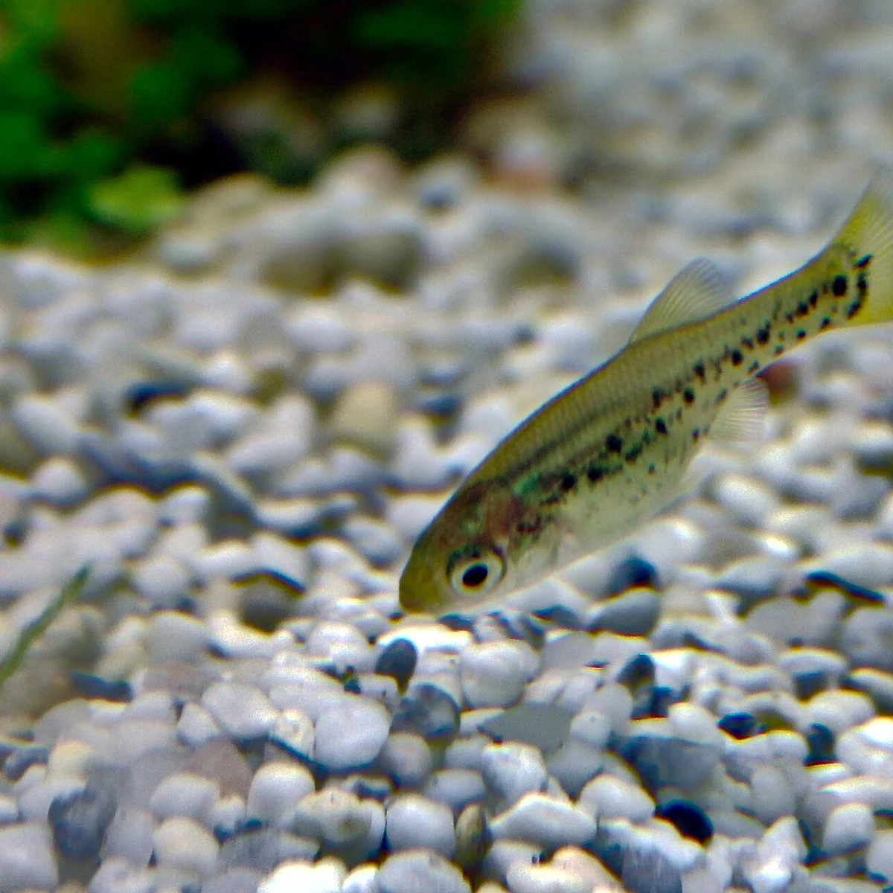
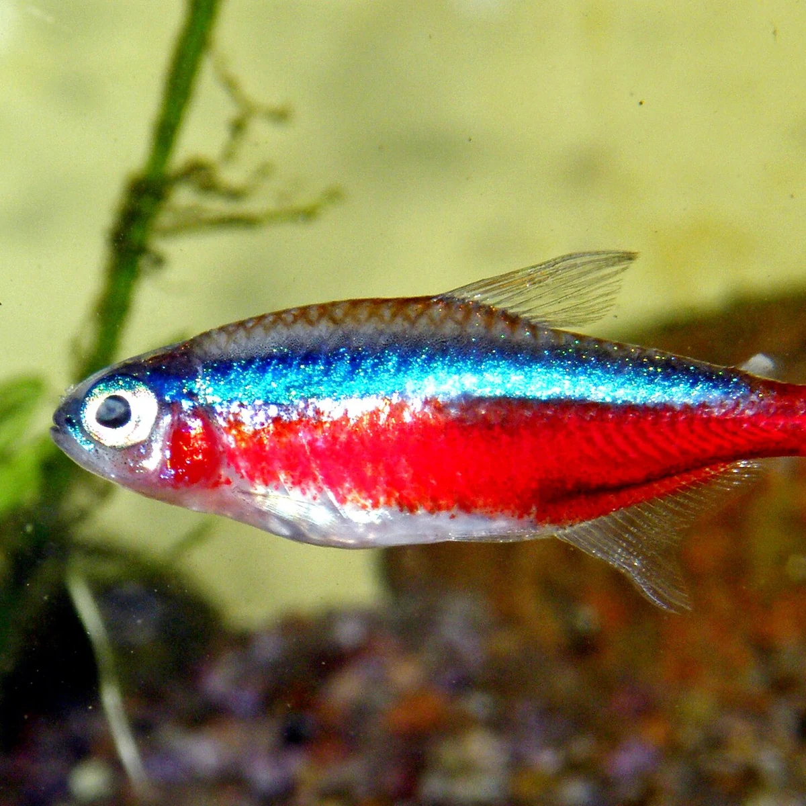

# Species image candidate review

Nothing in this report is approved or published yet.

Review identity, anatomy, crop, clarity, source, creator, attribution, license, and commercial/modification rights. Natural aquarium or neutral backgrounds are allowed. Reject images with solid letterbox bars, misleading content, bad crops, or unclear rights.

After reviewing every candidate, edit `data/images/species-image-review.json`. Put every slug in either `approved` or `rejected`, include a reason for every rejection, and set `rightsConfirmed` to `true` only after completing the rights review.

## american-flagfish

- Preparation: Prepared square WebP
- Source: [Wikimedia Commons](https://commons.wikimedia.org/wiki/File:Jordanella_floridae_182122551.jpg)
- Creator: nat_t
- License: [CC0](http://creativecommons.org/publicdomain/zero/1.0/deed.en)
- Attribution: https://www.inaturalist.org/photos/182122551

## angelfish

- Preparation: Prepared square WebP
- Source: [Wikimedia Commons](https://commons.wikimedia.org/wiki/File:Pterophyllum_scalare_03.jpg)
- Creator: Versions111
- License: [CC BY 4.0](https://creativecommons.org/licenses/by/4.0)
- Attribution: Own work

## betta-splendens

- Preparation: Raw source only; preparation required
- Source: [Wikimedia Commons](https://commons.wikimedia.org/wiki/File:Betta_fish_(Betta_splendens).gif)
- Creator: Atlas Þə Biologist (number 2)
- License: [CC BY 4.0](https://creativecommons.org/licenses/by/4.0)
- Attribution: Own work

## black-moor-goldfish

- Preparation: Prepared square WebP
- Source: [Wikimedia Commons](https://commons.wikimedia.org/wiki/File:Carassius_auratus_-_ilustraci%C3%B3n_gouache.jpg)
- Creator: Elixabette Arroiabe Azurmendi
- License: [CC BY-SA 4.0](https://creativecommons.org/licenses/by-sa/4.0)
- Attribution: Own work

## brilliant-rummynose-tetra

- Preparation: Prepared square WebP
- Source: [Wikimedia Commons](https://commons.wikimedia.org/wiki/File:Aquarium_tropical_du_Palais_de_la_Porte_Dor%C3%A9e_-_Petitella_bleheri.jpg)
- Creator: KoS
- License: [CC BY-SA 3.0](https://creativecommons.org/licenses/by-sa/3.0)
- Attribution: Own work

## bristlenose-pleco

- Preparation: Prepared square WebP
- Source: [Wikimedia Commons](https://commons.wikimedia.org/wiki/File:Ancistrus_cirrhosus_3.jpg)
- Creator: Emőke Dénes
- License: [CC BY-SA 4.0](https://creativecommons.org/licenses/by-sa/4.0)
- Attribution: kindly granted by the author

## bubble-eye-goldfish

- Preparation: Prepared square WebP
- Source: [Wikimedia Commons](https://commons.wikimedia.org/wiki/File:Carassius_auratus_-_ilustraci%C3%B3n_gouache.jpg)
- Creator: Elixabette Arroiabe Azurmendi
- License: [CC BY-SA 4.0](https://creativecommons.org/licenses/by-sa/4.0)
- Attribution: Own work

## buenos-aires-tetra

- Preparation: Prepared square WebP
- Source: [Wikimedia Commons](https://commons.wikimedia.org/wiki/File:Psalidodon_anisitsi_Natural_History_Museum_University_of_Pisa_(cropped_and_bright).jpg)
- Creator: Mattia Nocciola
- License: [CC BY-SA 4.0](https://creativecommons.org/licenses/by-sa/4.0)
- Attribution: File:Psalidodon_anisitsi_Natural_History_Museum_University_of_Pisa.jpg

## butterfly-splitfin

- Preparation: Prepared square WebP
- Source: [Wikimedia Commons](https://commons.wikimedia.org/wiki/File:Ameca_splendens_Jungtier_2016-12-11.JPG)
- Creator: Usien
- License: [CC0](http://creativecommons.org/publicdomain/zero/1.0/deed.en)
- Attribution: Own work

## cardinal-tetra

- Preparation: Prepared square WebP
- Source: [Wikimedia Commons](https://commons.wikimedia.org/wiki/File:Cardinal_Paracheirodon_axelrodi_(1).jpg)
- Creator: CHUCAO
- License: [CC BY-SA 3.0](https://creativecommons.org/licenses/by-sa/3.0)
- Attribution: Own work
