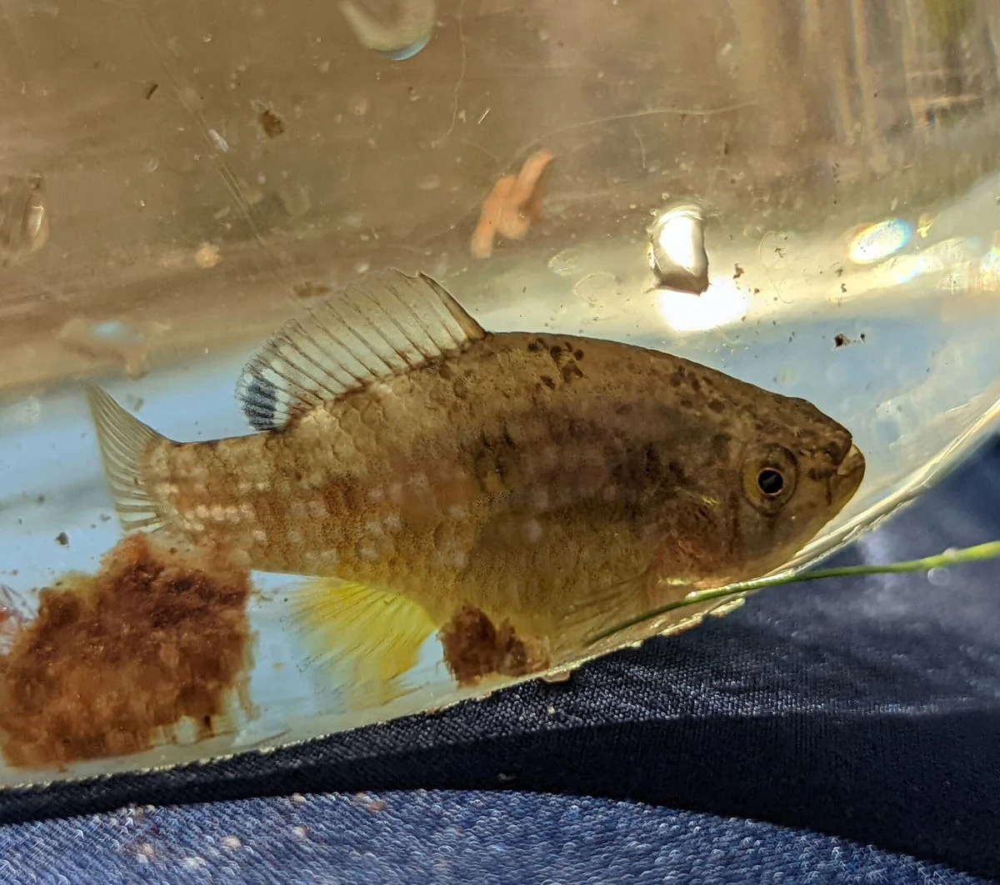
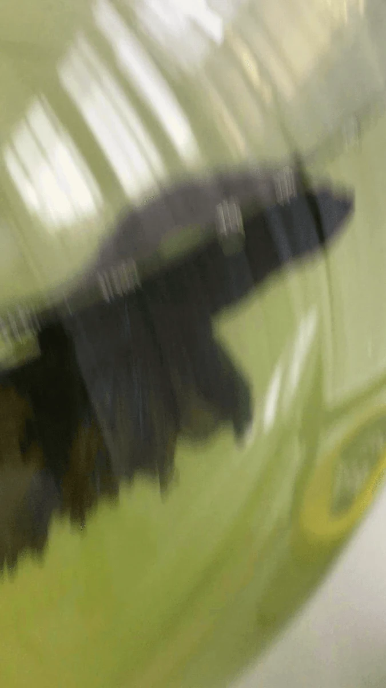
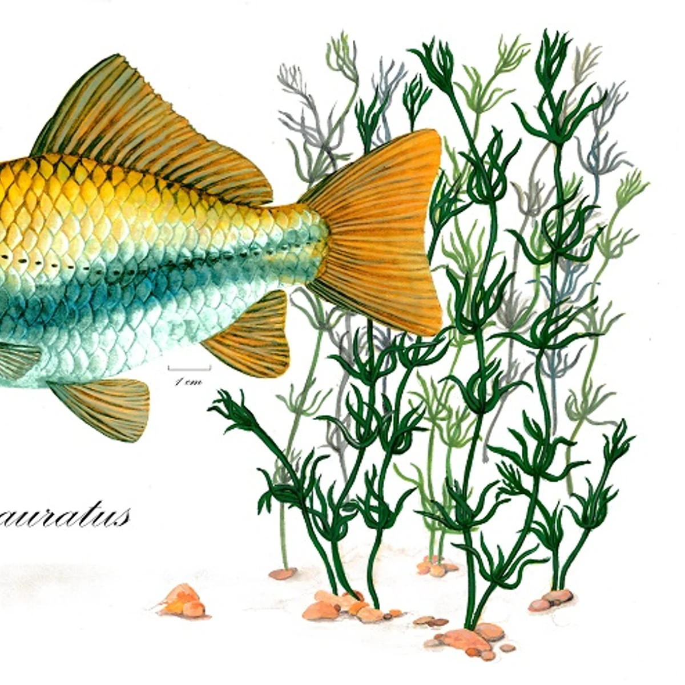
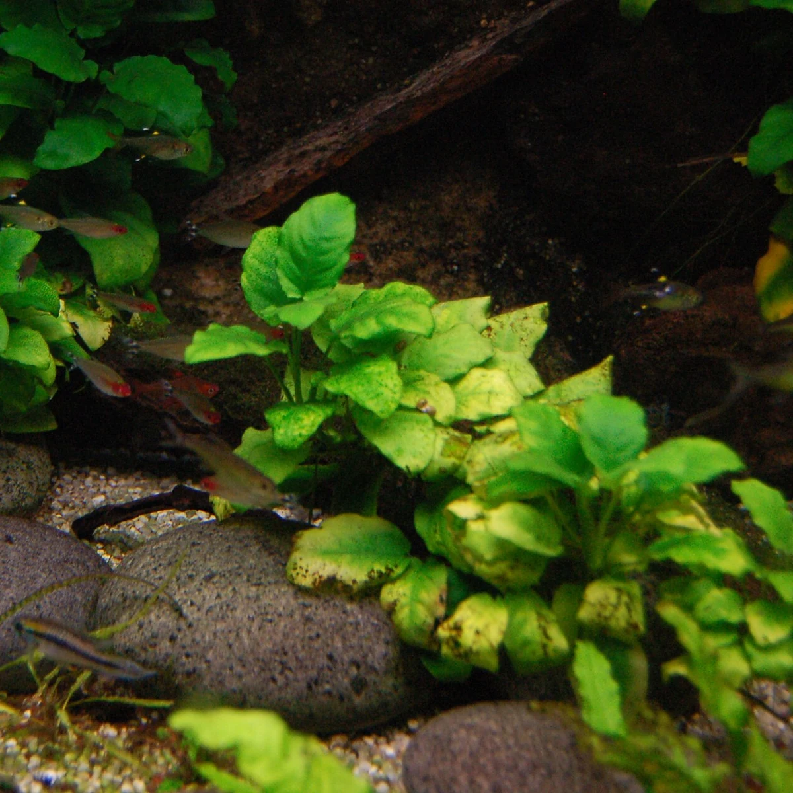
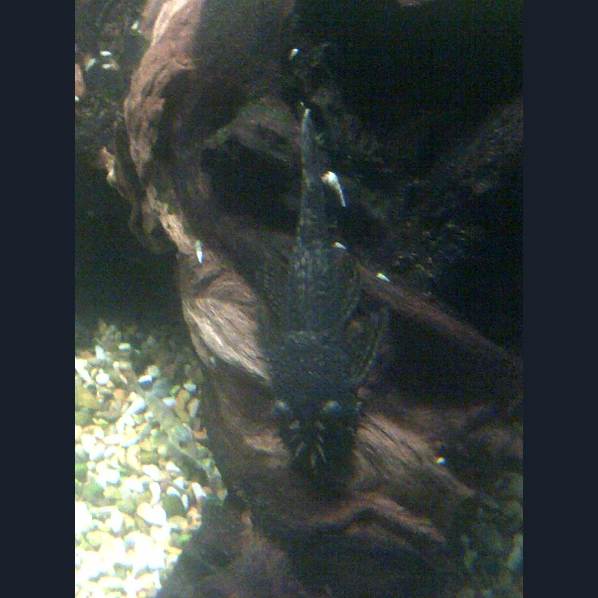
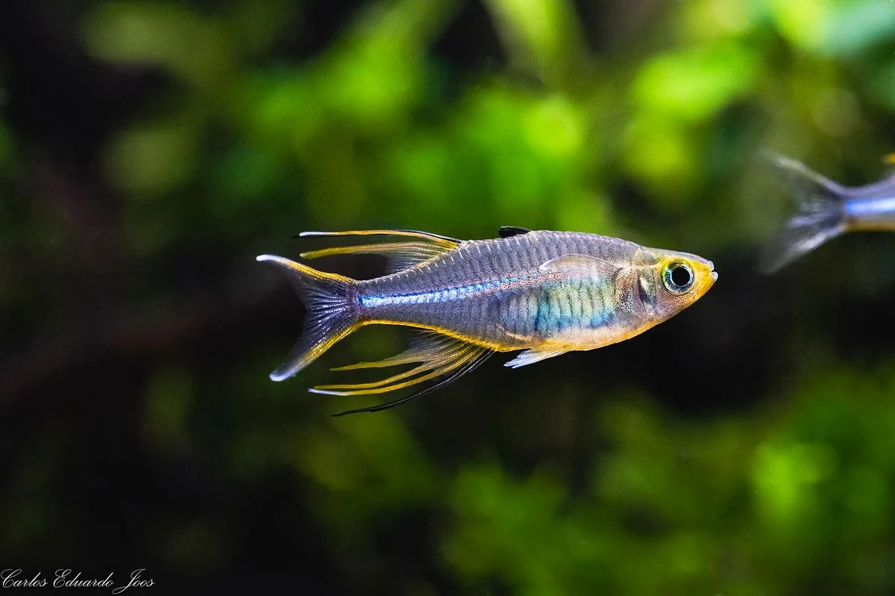
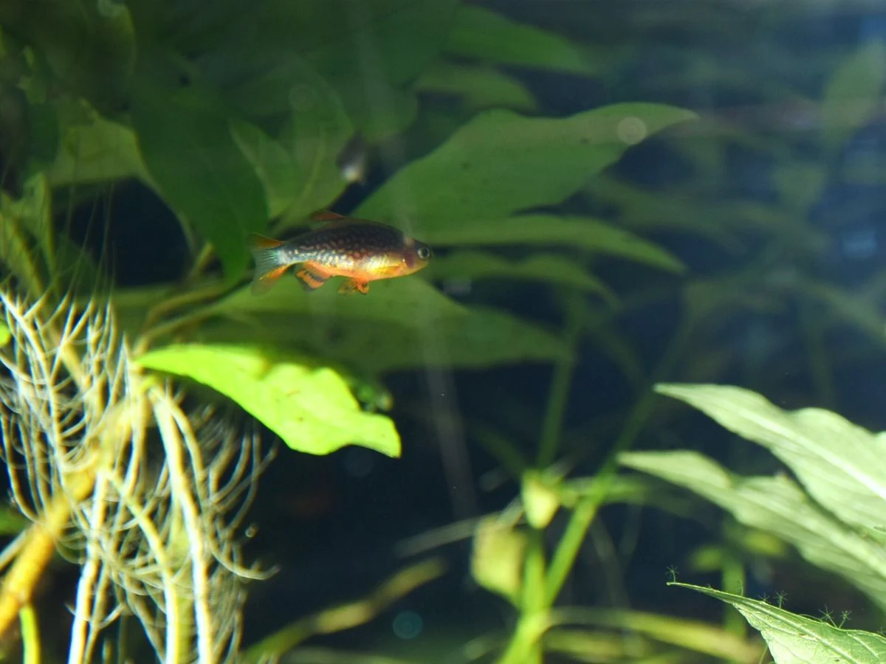
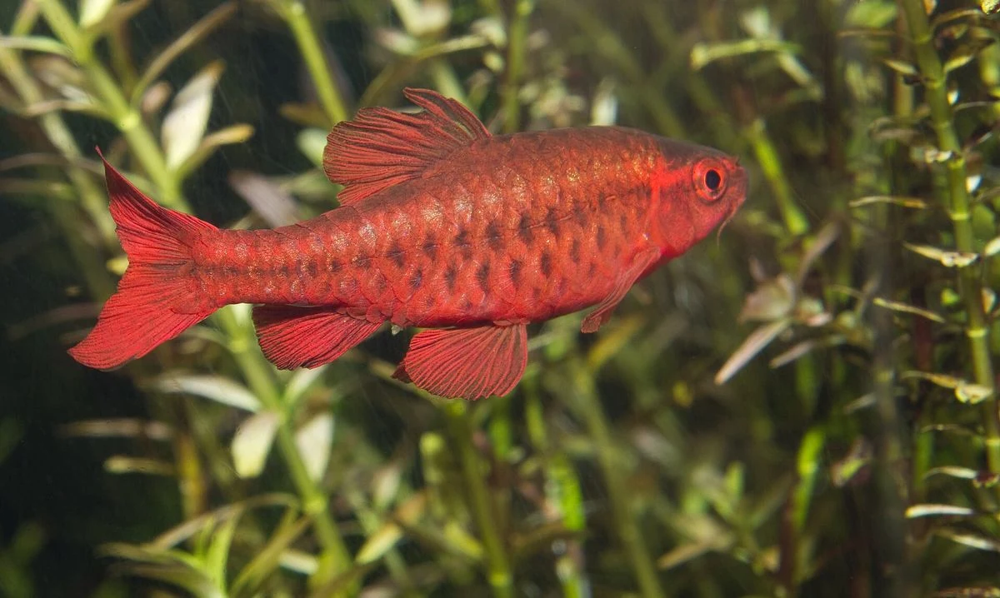
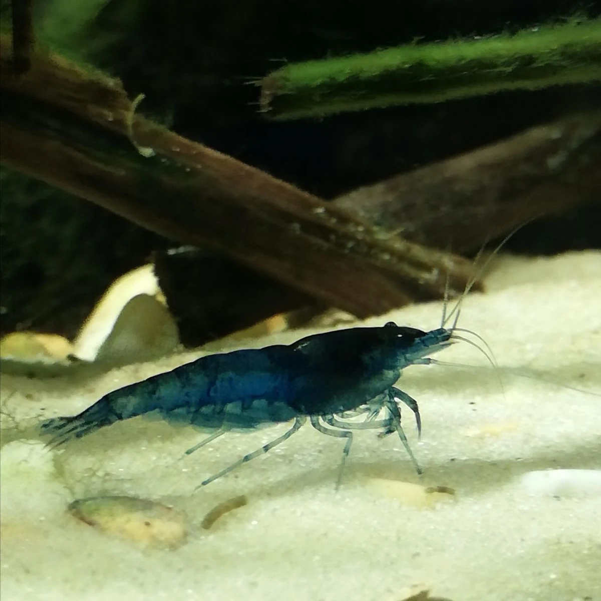

# Species image candidate review

Nothing in this report is approved or published yet.

Review identity, anatomy, crop, clarity, source, creator, attribution, license, and commercial/modification rights. Natural aquarium or neutral backgrounds are allowed. Reject images with solid letterbox bars, misleading content, bad crops, or unclear rights.

After reviewing every candidate, edit `data/images/species-image-review.json`. Put every slug in either `approved` or `rejected`, include a reason for every rejection, and set `rightsConfirmed` to `true` only after completing the rights review.

## american-flagfish

- Preparation: Prepared aspect-preserving WebP
- Source: [Wikimedia Commons](https://commons.wikimedia.org/wiki/File:Jordanella_floridae_182122551.jpg)
- Creator: nat_t
- License: [CC0](http://creativecommons.org/publicdomain/zero/1.0/deed.en)
- Attribution: https://www.inaturalist.org/photos/182122551

## betta-splendens

- Preparation: Prepared aspect-preserving WebP
- Source: [Wikimedia Commons](https://commons.wikimedia.org/wiki/File:Betta_fish_(Betta_splendens).gif)
- Creator: Atlas Þə Biologist (number 2)
- License: [CC BY 4.0](https://creativecommons.org/licenses/by/4.0)
- Attribution: Own work

## black-moor-goldfish

- Preparation: Prepared aspect-preserving WebP
- Source: [Wikimedia Commons](https://commons.wikimedia.org/wiki/File:Carassius_auratus_-_ilustraci%C3%B3n_gouache.jpg)
- Creator: Elixabette Arroiabe Azurmendi
- License: [CC BY-SA 4.0](https://creativecommons.org/licenses/by-sa/4.0)
- Attribution: Own work

## brilliant-rummynose-tetra

- Preparation: Prepared aspect-preserving WebP
- Source: [Wikimedia Commons](https://commons.wikimedia.org/wiki/File:Aquarium_tropical_du_Palais_de_la_Porte_Dor%C3%A9e_-_Petitella_bleheri.jpg)
- Creator: KoS
- License: [CC BY-SA 3.0](https://creativecommons.org/licenses/by-sa/3.0)
- Attribution: Own work

## bristlenose-pleco

- Preparation: Prepared aspect-preserving WebP
- Source: [Wikimedia Commons](https://commons.wikimedia.org/wiki/File:Ancistrus_cirrhosus_3.jpg)
- Creator: Emőke Dénes
- License: [CC BY-SA 4.0](https://creativecommons.org/licenses/by-sa/4.0)
- Attribution: kindly granted by the author

## bubble-eye-goldfish

- Preparation: Prepared aspect-preserving WebP
- Source: [Wikimedia Commons](https://commons.wikimedia.org/wiki/File:Carassius_auratus_-_ilustraci%C3%B3n_gouache.jpg)
- Creator: Elixabette Arroiabe Azurmendi
- License: [CC BY-SA 4.0](https://creativecommons.org/licenses/by-sa/4.0)
- Attribution: Own work

## celebes-rainbowfish

- Preparation: Prepared aspect-preserving WebP
- Source: [Wikimedia Commons](https://commons.wikimedia.org/wiki/File:Adult_male_of_a_CELEBES_RAINBOWFISH_Telmaterina_Ladigesi_MAROSATHERINA_LADIGESI_(51636246566).jpg)
- Creator: Carlos Eduardo Joos
- License: [CC BY 2.0](https://creativecommons.org/licenses/by/2.0)
- Attribution: Adult male of a CELEBES RAINBOWFISH Telmaterina Ladigesi MAROSATHERINA LADIGESI

## celestial-pearl-danio

- Preparation: Prepared aspect-preserving WebP
- Source: [Wikimedia Commons](https://commons.wikimedia.org/wiki/File:Cyprinidae_Danio_margaritatus_1.jpg)
- Creator: NasserHalaweh
- License: [CC BY-SA 4.0](https://creativecommons.org/licenses/by-sa/4.0)
- Attribution: Own work

## cherry-barb

- Preparation: Prepared aspect-preserving WebP
- Source: [Wikimedia Commons](https://commons.wikimedia.org/wiki/File:Cherry_barb,_Puntius_titteya.jpg)
- Creator: Brian Gratwicke
- License: [CC BY 2.0](https://creativecommons.org/licenses/by/2.0)
- Attribution: Flickr: Cherry barb, Puntius titteya

## cherry-shrimp

- Preparation: Prepared aspect-preserving WebP
- Source: [Wikimedia Commons](https://commons.wikimedia.org/wiki/File:Blue_dream_Neocaridina_davidi.jpg)
- Creator: Roth 1312
- License: [CC BY 4.0](https://creativecommons.org/licenses/by/4.0)
- Attribution: Own work
